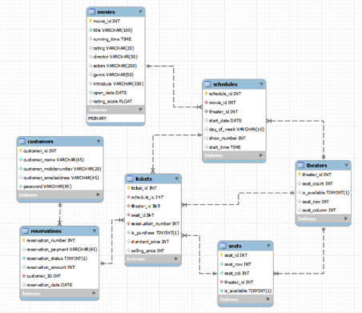
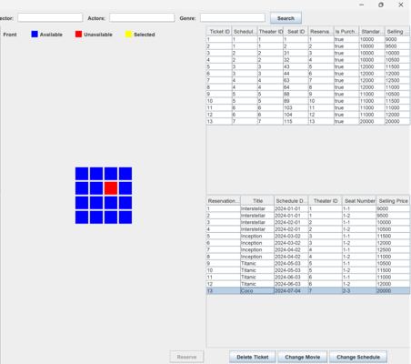
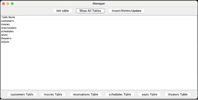

요구사항ID	요구사항명	상세설명
AA1	계정설정	관리자계정은 root/1234 사용자계정은 user1/user1으로 설정하고 생성한다.
AA2	MySQL
접속	MySQL 접속 코드는 수업시간시에 제공된 샘플코드와 동일한 코드를 사용해 접속한다.
AA3	로그인	GUI 화면에서 관리자를 선택하면 root/1234, 회원을 선택하면 user1/user1으로 로그인한다.
AA4	데이터베이스 초기화	관리자에 의해 데이터베이스를 초기화한다.
SQL의 drop table if exists, create table, insert into 를 사용한다.
AA5	데이터 입력	관리자에 의해 데이터베이스의 테이블에 데이터를 입력한다.
AA6	데이터 삭제	관리자에 의해 데이터베이스의 테이블에 존재하는 데이터를 삭제한다. 이때 ‘1개’의 특정 조건이 아닌 ‘조건식’을 입력받아 사용한다.
AA7	데이터 변경	관리자에 의해 데이터베이스의 테이블에 존재하는 데이터를 삭제한다. 이때 ‘1개’의 특정 조건이 아닌 ‘조건식’을 입력받아 사용한다.
AA8	전체 테이블 보기	관리자에 대해 모든 테이블의 내용을 보여준다.
AA9	영화 조회	영화명, 감독명, 배우명, 장르를 이용해 영화를 조회한다. 입력되지 않은 정보는 무시하고 조회한다.
AB1	영화 예매	조회한 영화에 대해 예매 기능을 구현한다. 이때 선택한 영화에 대해 좌석을 GUI로 표시하고 해당 좌석을 마우스로 선택할 수 있도록 한다.
AB2	예매 영화 정보 조회	예매한 영화에 대해 영화명, 상영관, 상영관번호, 좌석번호 및 판매가격 정보를 보여준다.
AB3	예매 영화 상세  정보 조회 	예매 정보 중 하나를 클릭하면 해당 예매에 대한 모든 상영일정, 상영관, 티켓에 대한 정보를 보여준다.
AB4	예매 영화 정보 삭제	영화에 대해 조회하고 한 개 이상의 예매 정보를 삭제한다.
AB5	예매 변경	예매한 영화에 대해 다른 영화로 변경한다.
AB6	상영 일정 변경	예매한 영화에 대해 다른 상영 일정으로 변경한다.
AB7	입력 기능	하나의 윈도우 안에서 모든 데이터를 기입하고 저장/취소 버튼 클릭 한번으로 입력되도록 구현한다.
AB8	오류처리	제약 조건을 벗어난 입력값에 대해 오류메시지를 표시하고 내용을 무시한다. 프로그램이 종료되지 않도록 한다.
AB9	새로운 영화
추가	관리자에 의해 영화 테이블에 새로운 영화 정보를 저장한다.
AC1	상영 일정 추가	관리자에 의해 상영일정 테이블에 새로운 상영일정 정보를 저장한다.
AC2	상영관 추가	관리자에 의해 상영관 테이블에 새로운 상영관 정보를 저장한다.
AC3	티켓 생성	티켓이 예매되면 티켓테이블에 티켓과 관련된 정보를 저장한다.
AC4	좌석 추가	관리자에 의해 상영관의 좌석 테이블에 새로운 좌석 정보를 저장한다.
AC5	회원고객 추가	새로운 회원고객에 대해 회원고객 정보를 추가한다.
AC6	예매 정보 저장	예매정보에 대해 예매번호, 결제방법, 결제상태, 결제금액, 회원아이디 및  결제일자를 저장한다.

